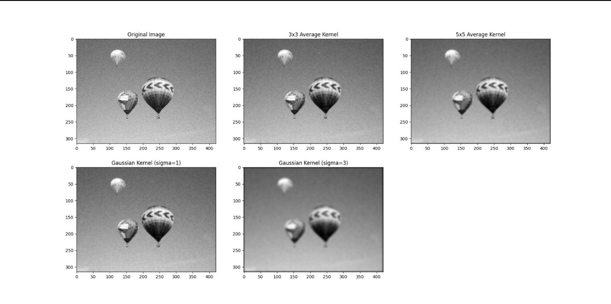
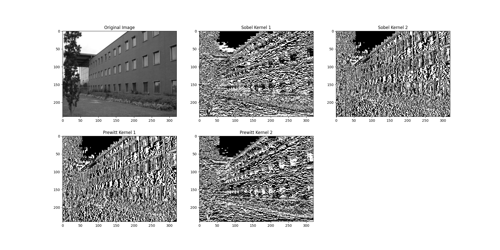

# Image Convolutions
Small project that implements the convolution operation between an image and variety of kernels.\
The idea was to implement the convolution operation (as naive as possible) to get a complete understanding of how the kernels work in the convolution.

## Usage
The project is set up to execute 2 examples: smoothing an image with average and Gaussian kernels, and detecting edges with the Sobel and Prewitt kernels.\
To do so, you only need to create a virtual python environment from the requirements.txt file. Using *venv* for example:

```shell
python -m venv .env

# for Windows users
source .env/Scripts/activate

# for Linux users
source .env/bin/activate

pip install -r requirements.txt
```

And run the command:
```shell
python main.py
```

## Results
The results are gonna be displayed and stored as "smoothing_results.jpg" and "edges_results.jpg".




## Kernels
The current list of kernels are:

- Sobel's edge detectors
- Prewitt's edge detectors
- Average (Smoothing)
- Gaussian

## TODO
- Current implementation is very naive and poorly optimized. Hence a small list of improvements to be made:
    - Use Python Generators whenever possible
    - Use vectorized/parallel operations from numpy
    - Use Cython for unavoidable pixel-by-pixel for loops

- Try more kernels and come up with my own kernels and see if the results are gonna come out as expected.